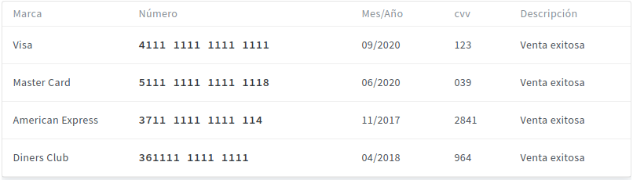

# E-commerce Produc Final

* **Track:** _Especialización Front-end_
* **Curso:** _CONSTRUYE UNA SINGLE PAGE APP (SPA) MULTI-USUARIO CONSUMIENDO DATA REMOTA_
* **Unidad:** _Producto final_

***

## Flujo de trabajo

1. Debes realizar un [**fork**](https://gist.github.com/ivandevp/1de47ae69a5e139a6622d78c882e1f74)
   de este repositorio.

2. Luego deberás **clonar** tu fork en tu máquina. Recuerda que el comando a usar
   es `git clone` y su estructura normalmente se ve así:

   ```bash
   git clone https://github.com/<nombre-de-usuario>/freelancer.git
   ```

3. Cuando hayas terminado tu producto, envía un Pull Request a este repositorio
   (puedes solicitar apoyo de tus profes para este paso).

# Pasarela de pagos **CULQI API**
**Culqi** permite a los comercios poder aceptar pagos en línea con tarjetas de crédito, débito o prepagadas, de forma rápida y segura. Una vez capturada la información de la tarjeta, puedes crear un cargo inmediatamente o de forma recurrente.

Finalmente, para este proyecto usamos las llaves de prueba de modo que las transacciones nunca pasan por las redes bancarias y no tienen ningún costo. (¡Recuerda usar tarjetas de prueba, no tarjetas reales al probar!).

#### Tarjetas de prueba

La información real de tarjetas de crédito o débito no pueden ser usadas para realizar pruebas en el entorno de integración. Usa cualquiera de estas tarjetas para realizar una cargo exitoso.

